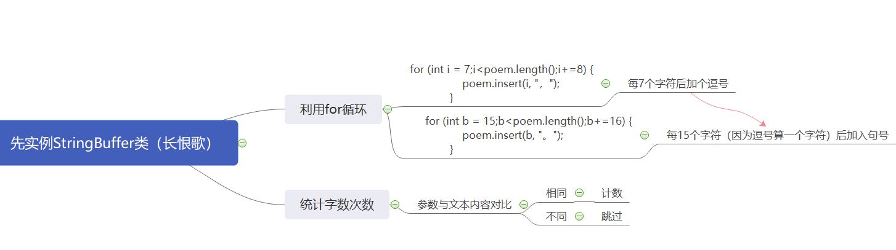
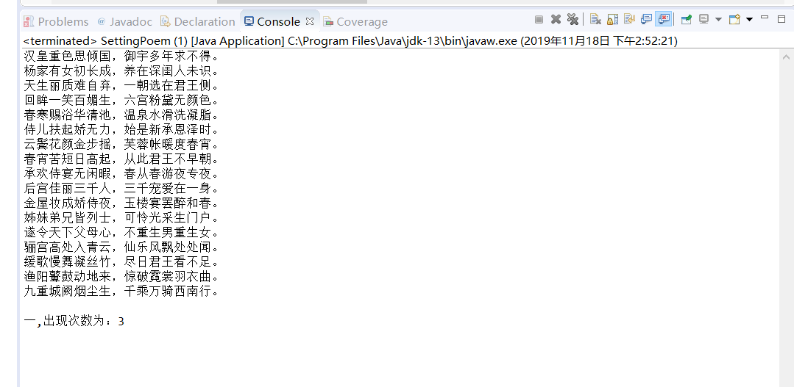

#字符串实验报告

实验目的：
  掌握字符串String及其方法的使用
  掌握异常处理结构
实验要求
  内容：利用已学的字符串处理知识编程《长恨歌》古诗的整理对齐工作，写出功能函数，并运行。达到如下功能：
  1：每7个汉字加入一个标点符号，奇数时加“，”，偶数时加“。”
  2：允许提供输入参数，统计古诗中某个字或词出现的次数
  3：考虑操作中可能出现的异常，在程序中加入异常处理程序

流程图：

核心代码与注释：
package eGene;
class SettingPoem{
 public static void main(String[] args) {
	 //StringBuffer实例中输入所需更改文本(长恨歌)参数
	 StringBuffer poem=new StringBuffer("汉皇重色思倾国御宇多年求不得杨家有女初长成养在深闺人未识天生丽质难自弃一朝选在君王侧回眸一笑百媚生六宫粉黛无颜色春寒赐浴华清池温泉水滑洗凝脂侍儿扶起娇无力始是新承恩泽时云鬓花颜金步摇芙蓉帐暖度春宵春宵苦短日高起从此君王不早朝承欢侍宴无闲暇春从春游夜专夜后宫佳丽三千人三千宠爱在一身金屋妆成娇侍夜玉楼宴罢醉和春姊妹弟兄皆列士可怜光采生门户遂令天下父母心不重生男重生女骊宫高处入青云仙乐风飘处处闻缓歌慢舞凝丝竹尽日君王看不足渔阳鼙鼓动地来惊破霓裳羽衣曲九重城阙烟尘生千乘万骑西南行 ");
	 StringBuffer word=new StringBuffer("一");//所想统计出现字符
     for (int i = 7;i<poem.length();i+=8) {//每7个字后加个逗号
    	 poem.insert(i, "，");
             }
     for (int a = 15;a<poem.length();a+=15) {
    	 poem.deleteCharAt(a);
             }
     for (int b = 15;b<poem.length();b+=16) {//每15个字符（因为逗号算一个字符）后加入句号
    	 poem.insert(b, "。");
             }
     for (int c = 16;c<poem.length();c+=17) {
    	 poem.insert(c, "\n");
             }
  System.out.println(poem);
  System.out.println(word+","+"出现次数为："+count(poem.toString(),word.toString()));
 }
  //统计字符总共出现次数，需要声明静态变量，贯穿主类始终，这样才能在主类内部调用
 static int count(String s1,String s2)
 {
  int start=0;
  int locate=-1;
  while((locate=s1.indexOf(s2,locate))>-1) {//定位所要字符的第一次位置
	  locate+=7;
	  start++;
	  }
  return start;
 }
}

运行截图：

实验心得：
此次实验流程并不复杂，功能也不高级，但运用了多次for循环以及镶套，具有一定的逻辑性。敲代码时，一定要把字符串对应序列搞清楚，字符串起始位置对应数字0，在第十四个字后加句号时，要注意前面加过的逗号也算一个字符这个细节，因此加逗号时，方法的参数应该为15。另外，我也学会了java遍历数组的语法，基本逻辑与python一致：先用for循环确定条件，再用数组中的切片序列i，如：int[i]，就能把数组全部遍历输出一遍。
